###Ashley Caputo added a comment - 7 hours ago
Luc Dang We had a second case of this come up where an ISBN was still showing as related to a book and I think you're right that it has to do with replacing a number.

```
 Could we prevent replace isbn function if this book was existed on amazon. (As we've prevented replace isbn function if this book was existed on ingram) ?
```  

1) From a CS perspective, I would like if the swap or replace ISBN function was disabled if the book was for sale with either Ingram or Amazon.


```
Could we remove the book on amazon when isbn was replaced by admin?
```
2) That is what we should be doing, but I much prefer just not being able to do it if the book is currently in Amazon.

- Is there a way to not destroy the ISBN, but to show it as a number that was once used in our system? That would help us for historical knowledge relating to a specific ISBN that was ever assigned or used in our system.

###Implement

####1) disabled the book was for sale on Amazon(Ingram)


####2) As solution 1, not being able to do it if the is currently in Amazon

####3) QnA: Currently we do not track history of ISBN

- 17/8/2016 10:09:13.000 +0700 Book004 submit to Amazon <PublicationDate>2016-08-16T16:33:23</PublicationDate>
project-format-id: 12330701
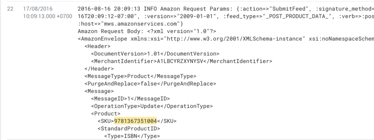

- 17/08/2016 16:51:46.000 +0700 Book004 was replaced by isbn003

- 17/09/2016 01:20:24.000 +0700 Book003 submit to Amazon <PublicationDate>2016-08-16T16:33:23</PublicationDate>
project-format-id: 12330701 (2016-08-16 19:47:19 INFO Attempting to assign isbn with number_text 9781367351004 to guts 7762272, cover_design 7858365, cover_type 6)
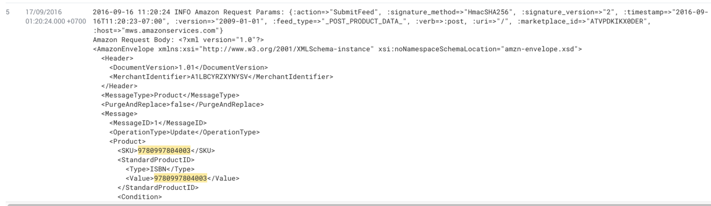


###Reproduce 9781366877529

- SubmitFeed Amazon 9781366877529 07/11/2016 15:39:07.000 +0700 
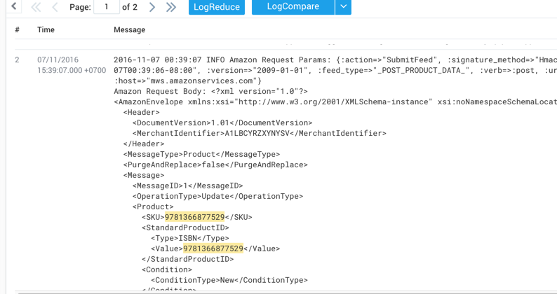

- 9781366877499 replace 9781366877529 on amazon
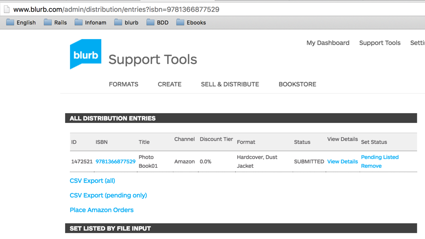

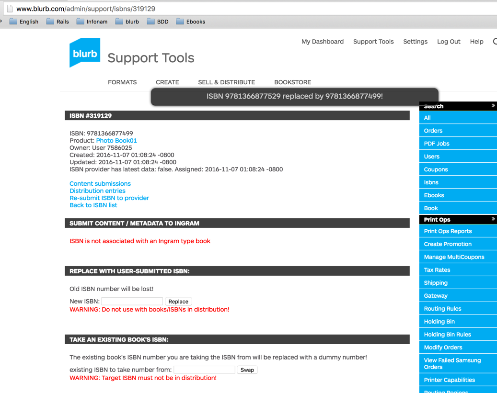


- SubmitFeed Amazon 9781366877499 07/11/2016 16:32:06.000 +0700

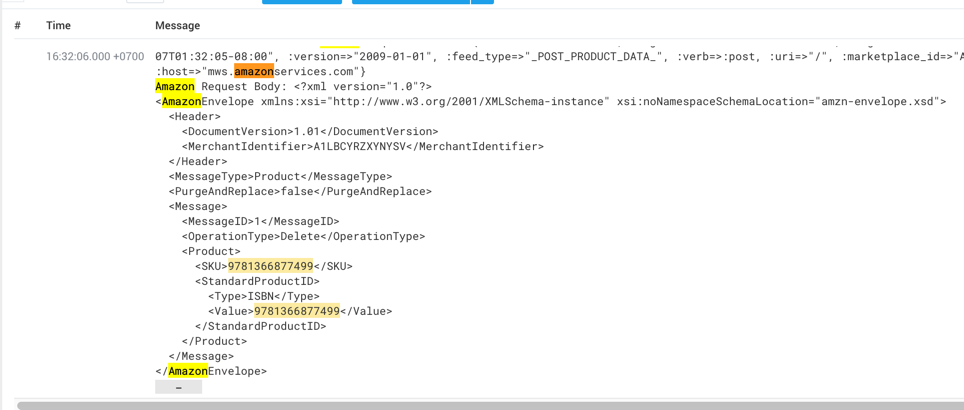

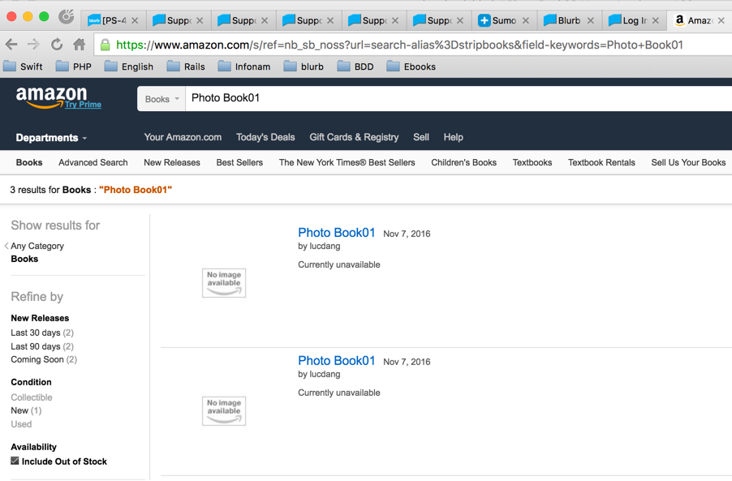


###Remove Product by Remove distribution_entries (9781366877581)

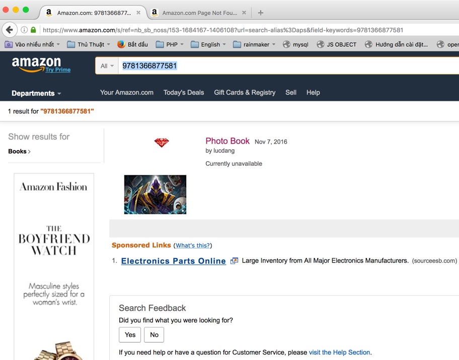

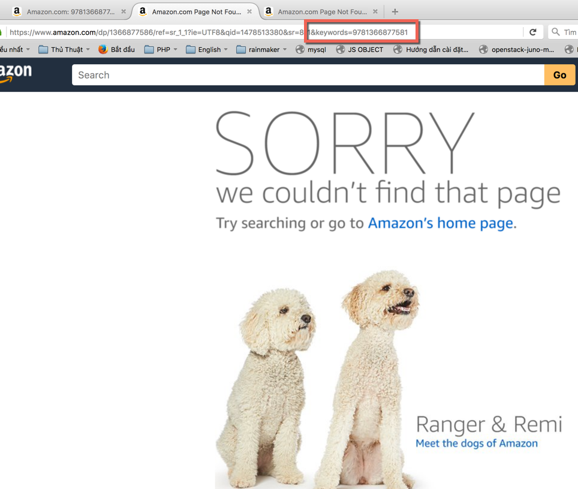

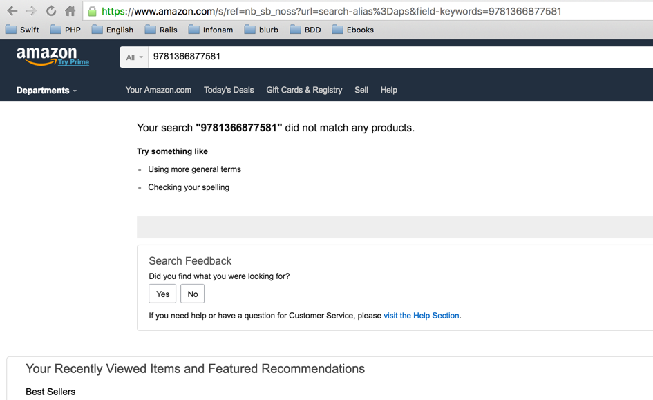


####Re-feed 9781366877581 with 9781366877352 9781366877529

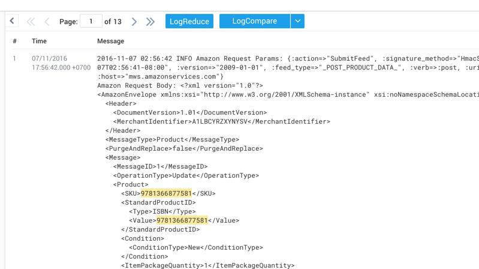

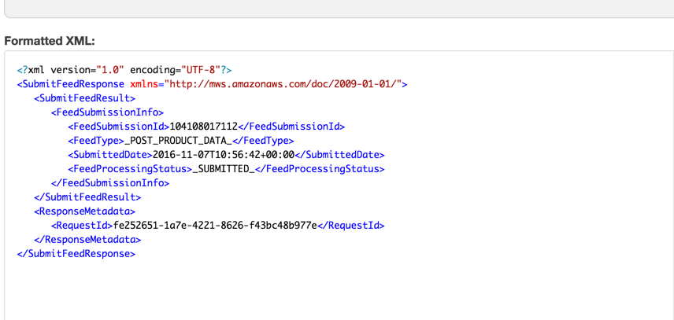

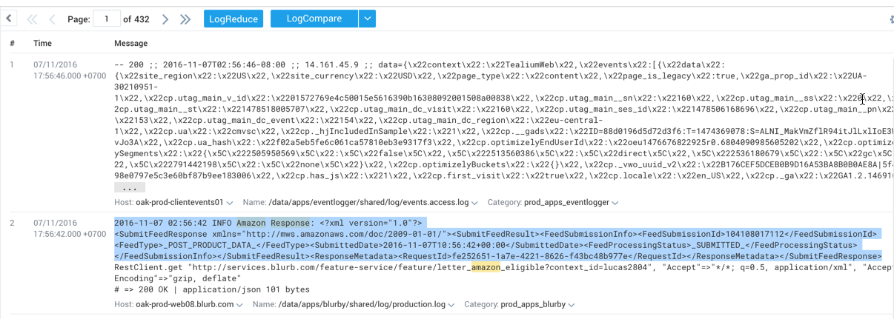
