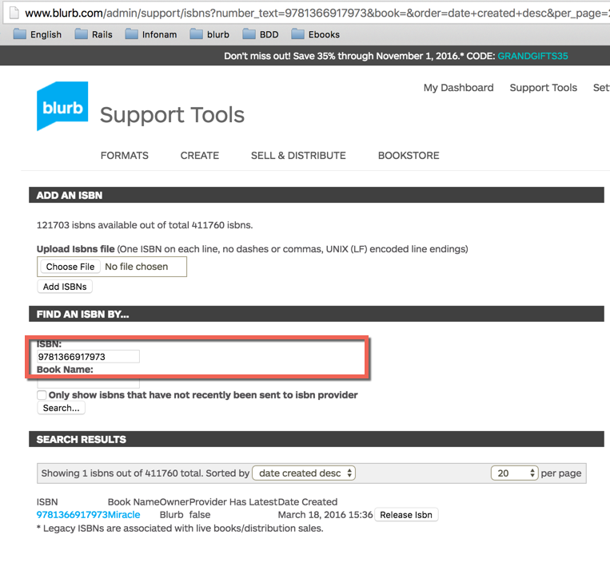
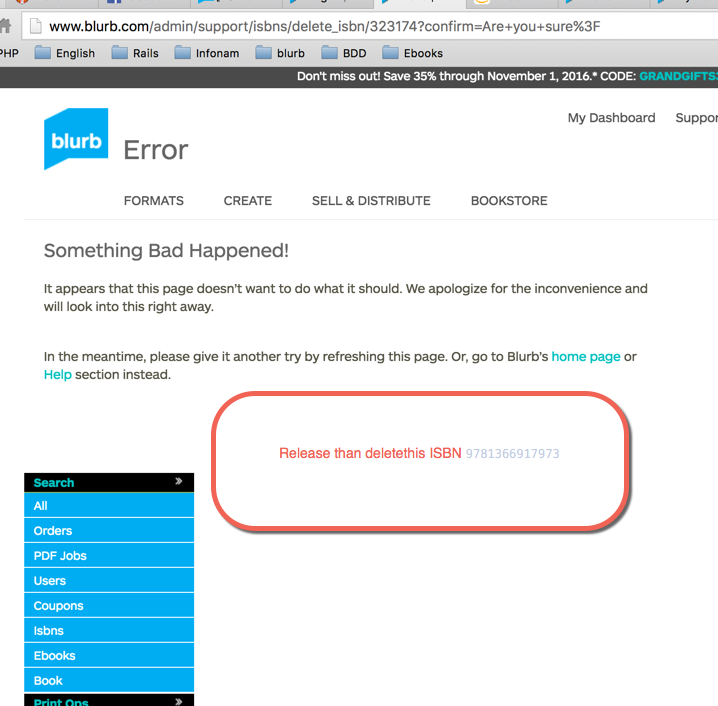

##PS-4810
- url: **https://blurb-books.atlassian.net/browse/PS-4810**
- description: 
Customer's book: **http://www.blurb.com/b/7290450-more-than-i-ask**
has **ISBN 9780997804003**: on the Blurb bookstore page, swearch page, customer Sell & Distribute page and on the ISBN page:
**http://www.blurb.com/admin/support/isbns/366477**
But, after submitting to Amazon, the Amazon listing shows ISBN 9781367351004. I thought this could be an Amazon listing error, except that when I search ISBN 9781367351004 in google, it returns the Blurb bookstore page as the only result: 
**https://www.google.com/search?q=9781367351004&oq=9781367351004&aqs=chrome..69i57j69i61.374j0j7&sourceid=chrome&ie=UTF-8**
It seems like this second ISBN is assigned to the book in our system somewhere, but when I search the ISBNs, it says "No ISBNs were found using the given terms."

##Working on files

###isbn.rb
- **http://www.blurb.com/admin/support/isbns/366477**
- Isbn#assign_isbn_to_ebook
- Isbn#replace_number
- When update to amazon, check on hemingway
- isbn	String	9781366917973 - Miracle
- isbn	String	9780997804003 - More Than I Ask
- isbn	String	9781367351004 - More Than I Ask
1) ProjectController#provideISBN        : GET
2) ProjectController#upload_complete    : GET
3) Check service/amazon/* : feed_submission_result_fetcher_spec.rb
9781366896360

###Reproduce bug

- Cùng ISBN trên blurb.
- Gửi 1 ISBN khác nền sai
- Task để submit lên Amazon,
- Có History, when submit this book, time.

###Check log 9781366917973-miracle /partner/content_submission/isbn/9781366917973
2016-10-28 00:31:17 INFO Updated distribution entry to state LISTED for ISBN 9781366917973, reason:
Host: oak-prod-worker13.blurb.com  Name: /data/apps/blurby/shared/log/production.log  Category: prod_apps_blurby 

###Sumologic Query
- ((_sourceCategory=prod_apps_blurby 9781367351004)
AND _sourceName="/data/apps/blurby/shared/log/production.log")
AND _sourceHost="oak-prod-web06.blurb.com"

The Miracle01 - swap with 9781366907158
Softcover ISBN: 9781366905826
Hardcover, ImageWrap ISBN: 9781366905833

(9781366907219, )
psql -h oak-bi-postgres02.blurb.com -d blurb_production -U tle
More Than I Ask
###Check hemingway9781366907226

send_amazon_distribution_feed
RAILS_ENV=test bundle exec spec spec/controllers/admin/distribution/amazon/content_submissions_controller_spec.rb:213
 submit_admin_distribution_amazon_content_submissions POST          /admin/distribution/amazon/content_submissions/submit(.:format)                      {:controller=>"admin/distribution/amazon/content_submissi00ons", :action=>"submit"}
             
             
- Remove book with ingram  than swap isbn
http://www.blurb.com/admin/distribution/entries?isbn=9781366907158 ...

###Check sync? , how long? , work?

- User "replace_number" được ko?, assign_another_isbn? (after create from bookwright, and cheat case). And always exist isbn when create from bookwright, do not care you click button save or not.
    1) isbn belongs to a book which can not be used to replace
    2) isbn free can use to replace,
    3) ??How to find ISBN free
    
- What old isbn of 003.
    1) replaced by 7426269-9781367344013
    2) 7290450-003
    
- Khi nào replace được, điều kiện. (với điều kiện nào.)
    1) do not exist in ingram
    2) free isbn, mean nil on cover_id, ebook_id, ...
    
- Kiểm tra khi replace có sync ko, nếu có thì ko cần phải kiểm tra.

- Both Code and log raise that Admin user try to override isbn through (replace_number) and do not sync
 
- Will update ISBN through amazon
 
 
 http://www.blurb.com/projects/7512367/provide_isbns?first_visit=true&provide_isbns=true&replace=
 
 https://affiliate-program.amazon.com/help/topic/t5/a16
 
 entries_controller
 
 