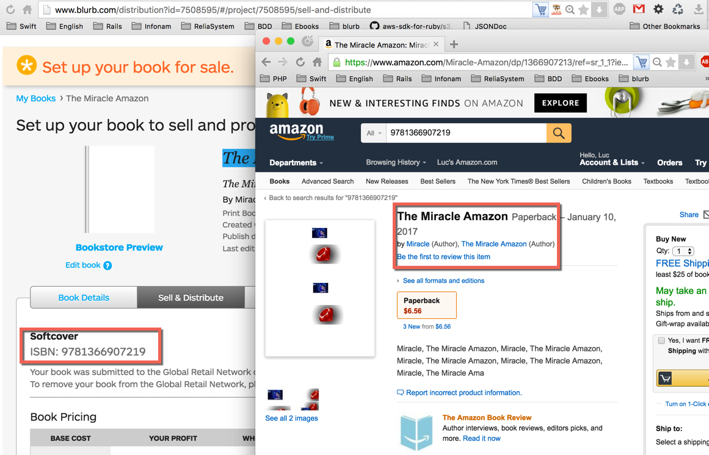
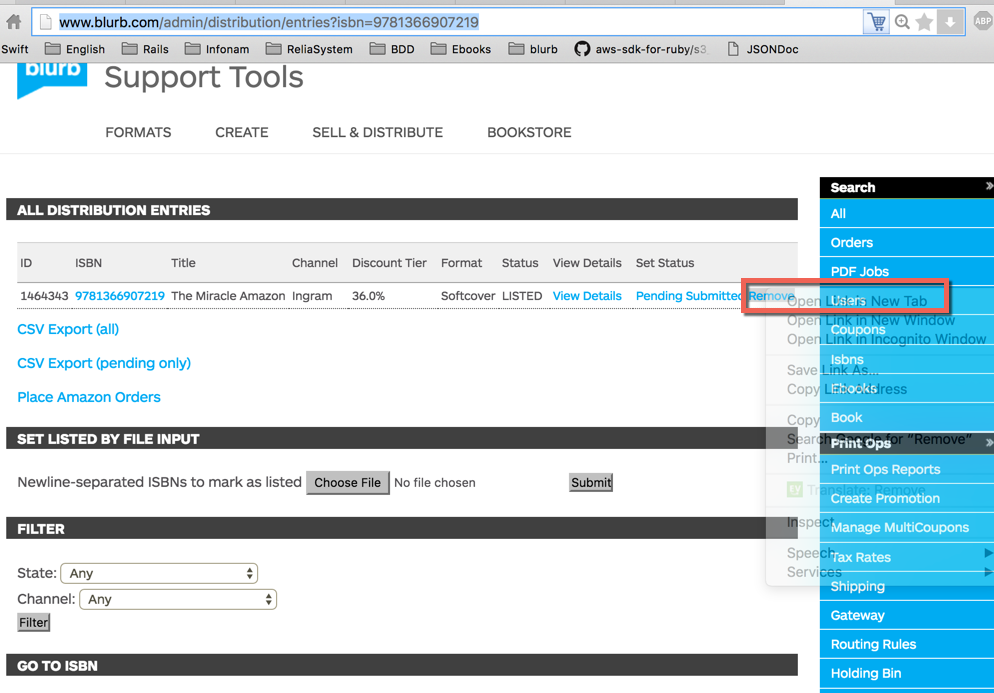

###Reproduce with 9781366907219
- EntryID: 1464343, isbn: 9781366907219, isbn_id: 322098
- EntryID: 1466247, isbn: 9781366906830, isbn_id: 322063
1) based on

2) remove amazon distribtuion



- master test.
264023	2867086456965	Amazon Book for en_AU	None	0.0%	Softcover	PENDING	View Details	Submitted Listed Remove

###Description
```html
On Dec. 28 I removed a book from Amazon distribution, as per customer's request. 
On the same day, the book disappeared from the customer's dashboard. 
The customer insists she did not delete the book from her dashboard and neither did I.
Book title: "Faces of Tent City - The Tent City Story - We Are People Too" 
ISBN: 9781367362512
http://www.blurb.com/b/7283373
Zendesk ticket: https://blurb.zendesk.com/agent/tickets/701954
Steps to reproduce:
1) Browse to customer's account: http://www.blurb.com/admin/support/users/show/6065606
2) Go to customer's dashboard: http://www.blurb.com/my/dashboard
The book should be there but the dashboard is empty
Expected results: restore book in customer's dashboard
Please let me know if you need more information. Thanks
```

```ruby
products = Product.all(:conditions => ['first_purchased_at IS NULL AND guts.created_at < ? AND products.id IN (189518, 189519) AND products.updated_at < ?', 15.days.ago, 15.days.ago], :include => :guts)
```