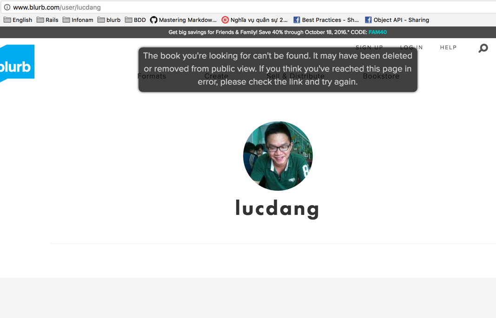
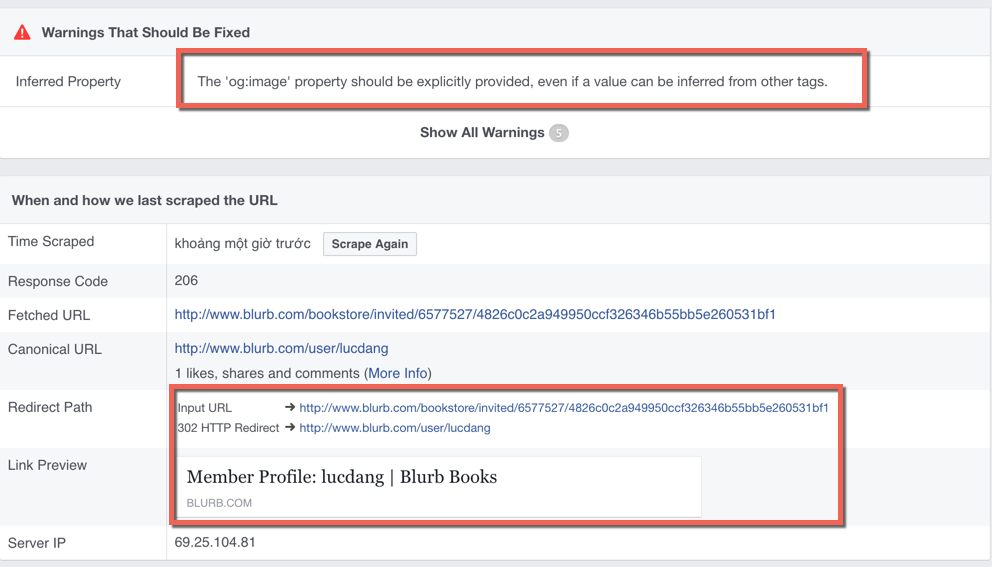
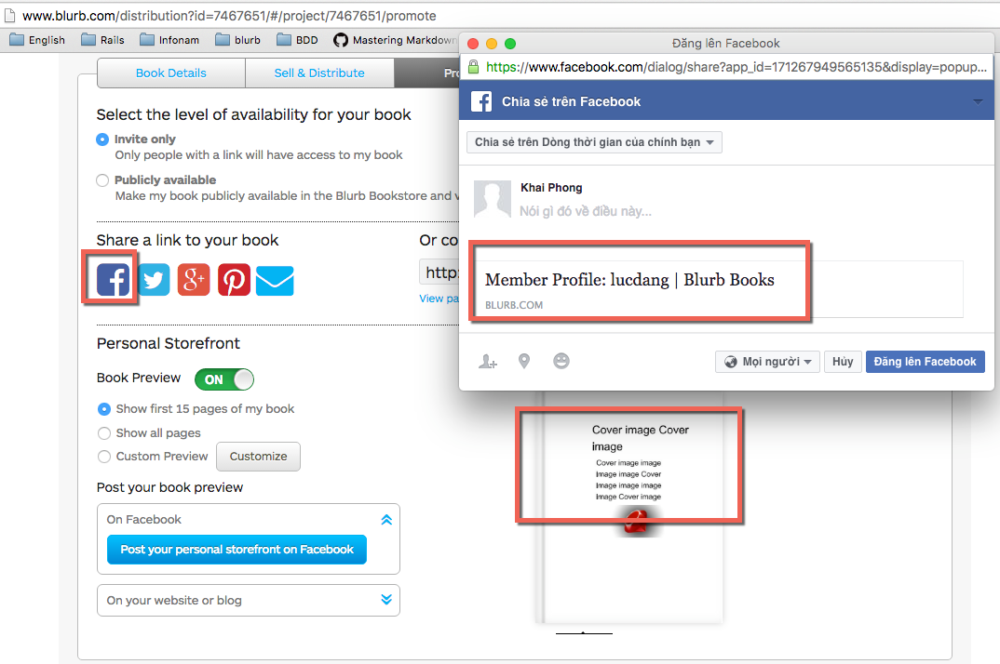

###Case 1: Invite only them same token
Invite_link: 
http://www.blurb.com/distribution?id=7467683#/project/7467683/promote
  1) Have **cover image** all things are correct
  - Display correct image, **og:image** the same with **cover_image**
  - Author  : 
      - Hemingway preview right
      - Hemingway share facebook right
      - Correct link
  - User    : have no way to share: Dashboard + Hemingway restrict user.

  2) Do not have **cover image**
  - **og:image** the same with **cover_image** (Blank image)
  - Preview image correct.
  - Facebook display correct.

###Case 2: Only for me
Only_for_me
http://www.blurb.com/distribution?id=7467651/#/project/7467651/promote

  1) Have **cover image**  
    - User: Failed   
    - redirect to author_profile
    
      
    !
  2) Do not have **cover image**
  - BLANK IMAGE, Display correct image, **og:image** the same with **cover_image**
  - Preview image correct.
  - Facebook display correct.

###Case 3: Softcover work as expected.

###How facebook sharing work

1) API just receive 1 share link
2) Crawler go into your website, find og_tag, og:image and display depend on og_image


###In code
1) @responsive_ebook_detail -> _open_graph.html.haml -> cover_image
2) @responsive_book_detail ->  _meta_book_html.erb
3) detail ->  _meta_book_html.erb

```html
_meta_book_html.erb: 
<meta property="og:image" content="<%= www_url + (book_detail.thumb_image_url.match(/^\/images/) ? book_detail.full_image_url : '/images/' + book_detail.full_image_url) %>"/>
```

####Implemting
1) Read test, run test, clear concept about @res_book, @res_ebook.
- stub at AppFeature.active?
- How to add 1 image in to it

`cover_designs`
bookstore_helper.rb#product_detail_img

1) check cover_design.cover_image
cover_design.cover_image

2) book_detail.full_image_url
cover_design.cover_image
http://www.blurb.com/bookstore/invited/6577527/4826c0c2a949950ccf326346b55bb5e260531bf1



