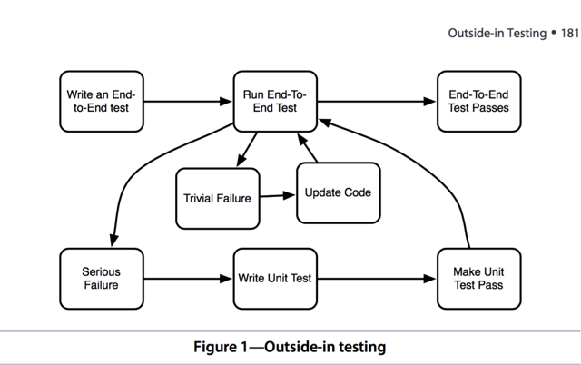

#Integration Testing with Capybara and Cucumber

##I - Important
- An integration test is the generic name for any test that combines more than one unit.
- In Rails, integration tests are often **end-to-end(black box tests)** tests. Meaning that they cover the entire system from the outside, making requests as a user would and validating the output a user would see.

- An acceptance test combines an end-to-end test with the idea that the test is specifying not only the behavior the program expects, focus on the behavior from the user.

- Integration tests as a skeleton of a house. Without integration tests, you can't specify how your application works together.
- Without unit tests thera are all kinds of potential holes that bugs can sneak through.

- **Prescription 23: DO NOT use integration test to specify logic of internal detail of your codebase as unit test. Instead of, Should be thinked about what problem in the code would make the test fail.**

###1 - Integration tests in Rails context.

- Describe a workflow, a real behavior from a user.
- Security issues that involve the interation between a user state and a particular controller action.

- **2 kinds of problems happend**: 
    - 1) The 1st is speed. Absolutely slower than unit tests cause it will retrieve Rails stack
    - 2) The second is accuracy. Because the integration test is not making any assertions until all pieces of code are done. It often hard to detect where the errors happen. **Often the way to deal with this is to have a failing integration test trigger the writing of a unit test.**
    
###2 - Unit tests in Rails context

- Should be covered what happen if data is nil or has an expected value.
- Internal implementation details of business logic.


##II - Capybara(I hated it)

- Capybara allows an automated test to simulate a user interaction with a browser.

###1 - Outside-in Testing

- We start using Capybara to write a test from the outside and **use that test to drive our unit tests**

- This integration tests should:
    - 1) **Give**: data.
    - 2) **When**: one or more user interactions.
    - 3) **Expected**: valid HTML responses.     



###2 - Using Capybara to write a test

```ruby
/spec/features/add_task_spec.rb
describe "adding a new task" do
  fixtures :all
  it "can add and reorder a task" do
    visit project_path(projects(:bluebook))
    fill_in "Task", with: "Find UFOs"
    select "2", from: "Size"
    click_on "Add Task"
    expect(current_path).to eq(project_path(projects(:bluebook)))
    within("#task_3") do
      expect(page).to have_selector(".name", text: "Find UFOs")
      expect(page).to have_selector(".size", text: "2")
      expect(page).not_to have_selector("a", text: "Down")
      click_on("Up")
    end
    
    expect(current_path).to eq(project_path(projects(:bluebook)))
    within("#task_2") do
      expect(page).to have_selector(".name", text: "Find UFOs")
    end
  end
end

```

- I like using fixtures for integration tests because their transactional nature makes them much faster than creating the objects  anew for each test.

```yaml
bluebook:
  name: Project Blue Book
  due_date: <%= 6.months.from_now %>
```

- As you can practice through this book:
    - 1) Write integration test **it "can add and reorder a task"**
    - 2) We'll use integration test to drive some unit-tests
        - 2.1) **"task can move up"** in task_spec.rb
        - 2.2) **"task can move down"** in task_spec.rb
        - 2.3) **"detect 1st task and 2nd task through project_order"** in task_spec.rb
        - 2.4) **"give me an order of first_task"** in project_spec.rb
        - 2.5) **"give me an order of next_task"** in project_spec.rb
        
##III - Trying Cucumber

- Cucumber is a tool for writing acceptance tests in plain language.

###1 - Writing Cucumber

- 1) Write features **features_add_task.feature**
- 2) Write step_definition for each step in this features(**features/step_definitions/add_task_steps.rb**). 

- **Given a project** will match with Regular Expression as  **/^a project$/**

```yaml
file: features_add_task.feature
Feature: Adding a task 
  Background:
    Given a project
  Scenario: I can add and change priority of a new task
    When I visit the project page
    And I complete the new task form
    Then I am back on the project page
    And I see the new task is last in the list
    When I click to move the new task up
    Then I am back on the project page
    And the new task is in the middle of the list
```


```ruby
Given(/^a project$/) do
  pending # express the regexp above with the code you wish you had
end
When(/^I visit the project page$/) do
  pending # express the regexp above with the code you wish you had
end

#...

Then(/^I am back on the project page$/) do
  pending # Write code here that turns the phrase above into concrete actions
end

#....

```

