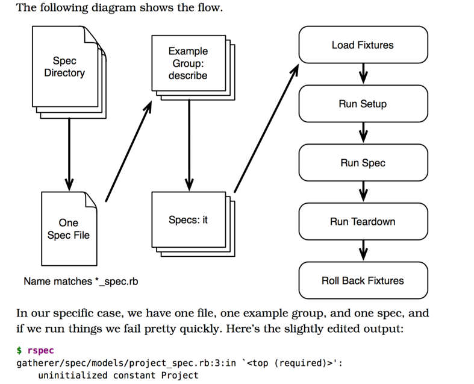

#TDD Basics

###I - Rspec
####1) RSpec Diagram



####2) let lazy load

1) Use as local variable (often use in describe context)
2) The first call to let variable invokes the block and **caches the result**

####3) Matcher
```html
- be_a_user, be_an_apple will looking for user? apple? than a_user? an_apple?
expect(project).to be_done <=> expect(project.done?).to be_truthy

-  have_key(:id) will call has_key?(:key) on the target
expect(projects).to have_key(:id) 

```
- http://www.rubydoc.info/github/rspec/rspec-expectations/RSpec/Matchers

###2) Before write a test

- I like to take a moment before I write a test to think about what the test needs. The typical test structure has three parts:

1) **Given**: What data does the test need? 
2) **When**: Which action to trigger?
3) **Then**: Which result to expect?
