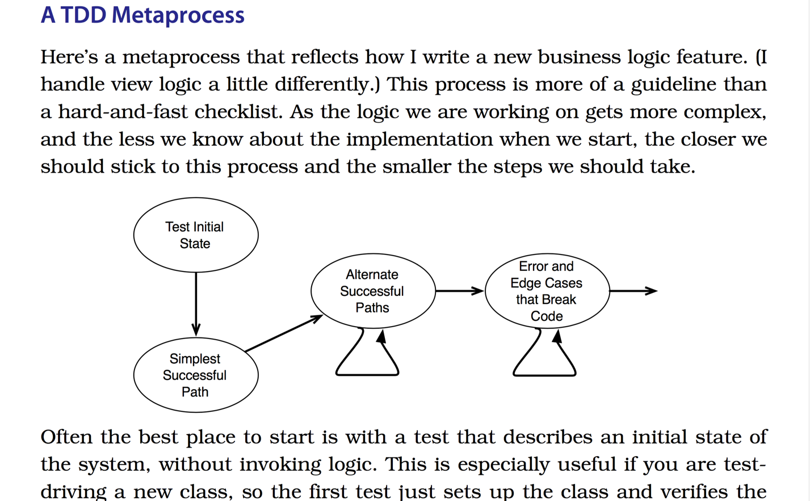

#Chapter5  - Testing Models

##I - A TDD Metaprocess

- Often the best place to start is with a test that describes an initial state of the system, of the new class.



- Take a list test cases
- Just implement only one test case at a time

##II - Refactoring Models

- Refactoring is where you think about your code and how best to structure it.
- Refactoring is where a lot of design happens in TDD, and it's easiest to do in small steps. Nerver skip it.
- Refactoring is not a luxury that you can throw aside. **Do not skip refactoring step when you're in hurry**.

##III - Break Up Complexity

- Prescription 11: Try to extract methods when you see compound Booleans, local variables, or inline comments.

- **A set of boolean logic** should be gone in its own method(valid_name?, has_purchased_before?)
- **Local variables** are relatively easy to break out into methods with the same name as the variable. **You'll be surprised at how much more flexible your code feels if you minimize the number of local variables in methods.**

- Single-line comment often describe what the next part does. So encapsulate the next part into method(30 lines into 5 methods). Each method should be responsibled for only one feature.

##IV - Combine Duplication

- 3 kinds of duplication: duplication of fact, duplication of logic, and duplication of structure.

###1) Duplication of fact
- Duplication of fact is usually easy to see and fix. A common case would be a "magic number".

```ruby
# 5 is a magic number
validates :size, numericality: {less_than_or_equal_to: 5}
def possible_sizes
  (1..5)
end

# 5 is represented by MAX_POINT_COUNT
MAX_POINT_COUNT = 5
validates :size, numericality: {less_than_or_equal_to: MAX_POINT_COUNT}
def possible_sizes
  (1..MAX_POINT_COUNT)
end
```

###2) Duplication of logic
- Duplication of logic is similar with duplication of fact. Instead of looking for simple values(magic number),
we're looking for **longer structure**. 
- Something like(compound Boolean statements: task_has_been_complete?, simple calculate: max_posts)

```ruby
class User
    def maximum_posts
      if status == :trusted then 10 else 5 end
    end

    def urls_in_replies
      if status ==  :trusted then 3 else 0 end
    end
end
```

###3) Duplication of structure (Find Missing Abstractions)

- Duplication of structure often means there's a missing abstraction **Which means you can move some code into a new class**

- One symptom is a set of common attributes that are always used together.
- Another symotom is a group of methods that all share a prefix or a suffix such as: logger_init, logger_print...

- Some benefits:
    - 1) It's easy when you need to add middle_name, title_name, complexity_name
    - 2) It's easy to test cause NameService no longer has a dependency on the database.

```ruby
# Model's getting fat.
class User < ActiveRecord::Base 
  def full_name
    "#{first_name} #{last_name}" 
  end
  
  def sort_name
    "#{last_name}, #{first_name}"
  end
   
  def sir_name
    "Sir #{first_name}"
  end 
  
  def blabla_name
    "blabla #{first_name}"
  end
  #... some kind of names to display
end

# Make model become healthy with new class "Name"
class NameService
  attr_reader :first_name, :last_name
  
  def initialize(first_name, last_name)
    @first_name, @last_name = first_name, last_name
  end
  
  def full_name
    "#{first_name} #{last_name}" 
  end
    
  def sort_name
    "#{last_name}, #{first_name}"
  end

  def sir_name
    "Sir #{first_name}"
  end 
  def blabla_name
    "blabla #{first_name}"
  end
end

# Then model just only 4 lines
class  User < ActiveRecord::Base
  delegate :full_name, :sort_name, :sir_name, :blabla_name, to: :name_service
  def name_service
    NameService.new(first_name, last_name)
  end
end

```
###3.1 - Duplication of structure

- When you have separated functionality into separate classes,it's easier to see what behavior belongs there(ez to test).

```ruby
class Task
  def calculator
    if complete?
      CompleteTaskCalculator.new self
    else
      IncompleteTaskCalculator.new self
    end
  end
end
```


