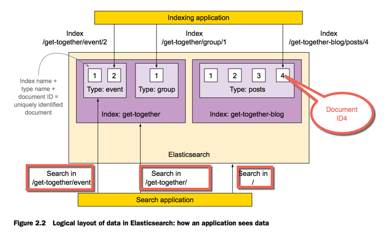
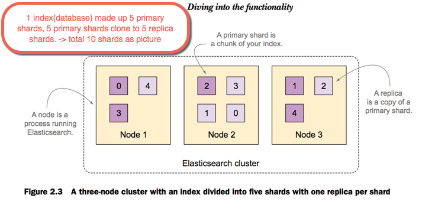
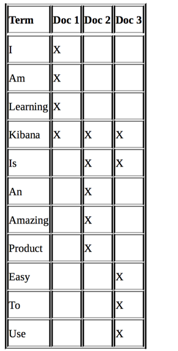

##_**Concept**_

####_**1 - Document**_

- Document(JSON) as a **row** in DB, smallest unit of data that you be able to index. 
```javascript
event: {
  "name": "Event Elasticsearch Developer",
  "organizer": "Lee",
  "location": {
    "name": "Denver, Colorado, USA",
    "geolocation": [39.7392, -104.9847]
  }
}
```
####_**2 - Type**_

- Type as **table** in DB.(as _event_, _location_, _string_, _float_...)

####_**3 - Index**_

- Index is biggest container as **Database**



####_**4 - Shard**_

- 1 index(database) made up 5 primary shards, 5 primary shards clone to 5 replica shards -> Total 10 shards(**2** databases).

Note: Disk limit is 1 TB and an index exceeds 1 TB.
-> These break the index into multiple shards.
-> Each shards acts as an **independent index**

####_**5 - Node**_

- Node as server when you start Elasticsearch on local.

####_**6 - Cluster**_
- 10shards/3nodes/1cluster (Have the same cluster name as cluster_search_product...)




```
| MySQL         | Elasticsearch     |
| ---           | ---               |
| Databases     | Indexes           |
| Tables        | Types             |
| Colums/Rows   | Documents with Fields|
```


#### Inverted Index

1) Instead of searching text, it searches for an index 

- i am learning Kibana
- Kibana is an amazing product
- Kibana is easy to use




