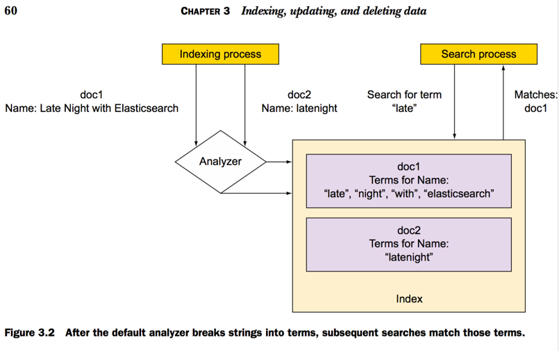
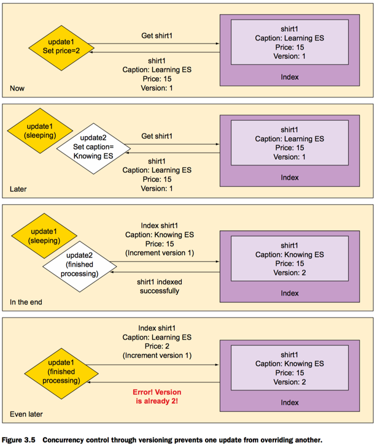
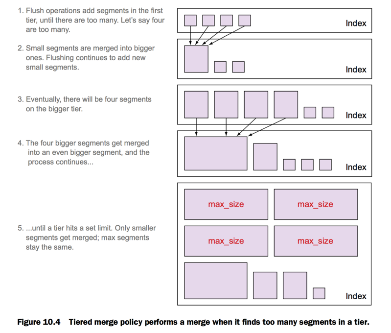

###The truthy of index a string

#### Default analyze when index
**Input**: "Late Night with Elasticsearch"

1. Lower all letters
2. Breaks the string into _words_ that called _terms_ (late, night ...)



- "late" do not match "latenight" in doc2
- "late" match "late" in doc1


#### Not analyzed

```
 curl -XPUT 'localhost:9200/get-together/_mapping/new-events' -d '
 {
      "new-events" : {
        "properties" : {
          "name": {
           "type" : "string",
            "index" : "not_analyzed" }
 }}}'
```

 - Index full string as one term.
 (match "_big data_", not just "_big_" or "_data_" )
 
#### Implementing concurrency control through versioning

- update1 sleep
- update2 success with version=2
- update1 wakeup and update but **Error! Version is already 2!**

!

```
Example Thread.sleep(10000):

curl -XPOST 'localhost:9200/online-shop/shirts/1/_update' -d '{
  "script": "Thread.sleep(10000); ctx._source.price = 2"
}' &
curl -XPOST 'localhost:9200/online-shop/shirts/1/_update' -d '{
  "script": "ctx._source.caption = \"Knowing Elasticsearch\""
}'
```

#### Index Technique
- Mysql index depend on a row
- **Inverted Indexing** technique index depend on term.

**someone help me confirm this**: when index "big data", if exist terms "big" && "data" will add documentID into "big" && "data"

#### ??? Segments and merging
- A Shard _extend_ a **segment** when you index new document.

- When delete a document just mark document as _deleted_

- Actually deleting is remove documents out of segments during segment merging)

- Segments as immutable sets of files that Elasticsearch uses to store indexed data
-> faster, easy to cache.

**someone help me confirm this**: at least how many document in one segment 

 
