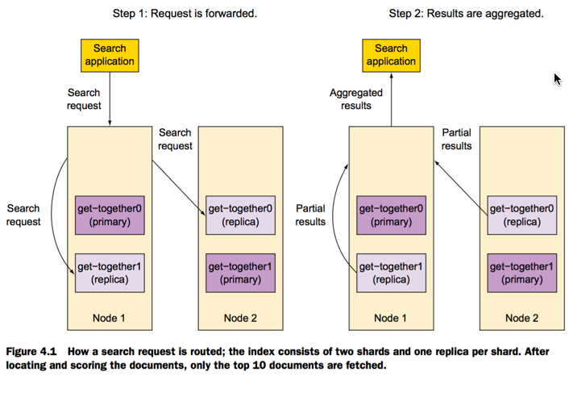
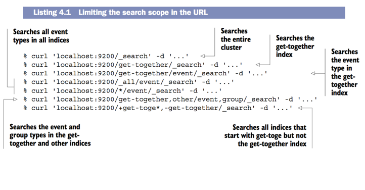
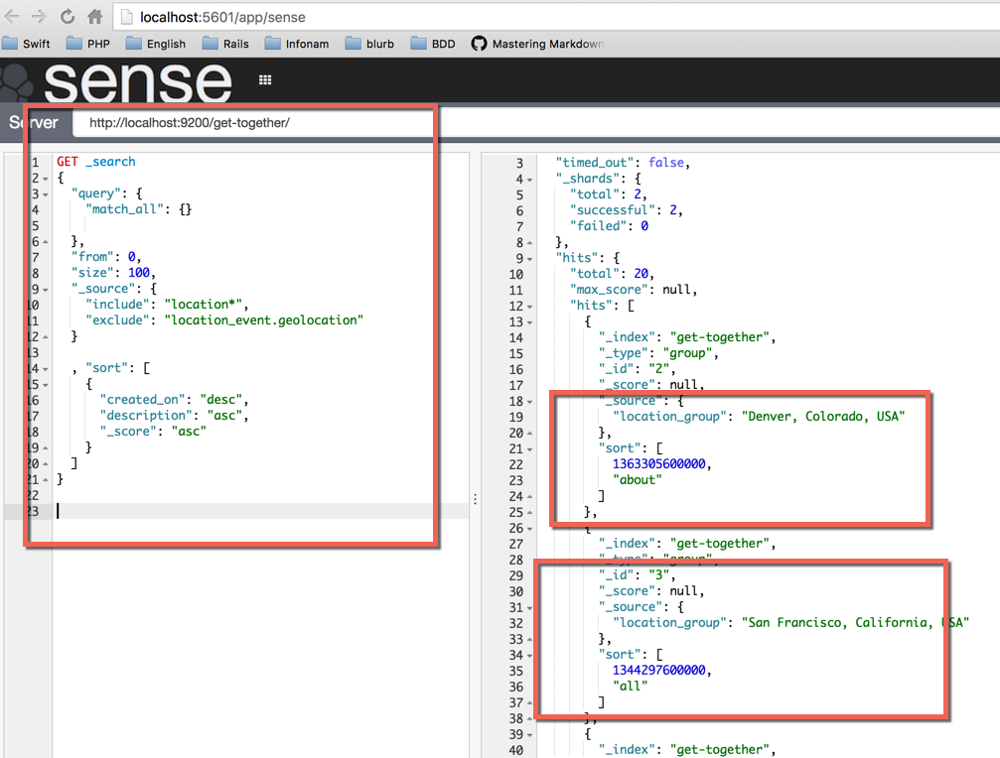
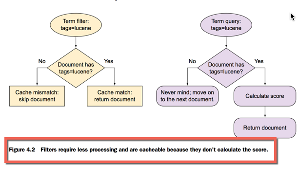
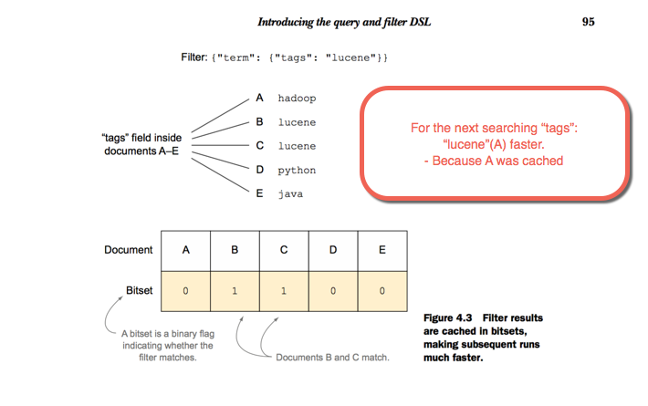
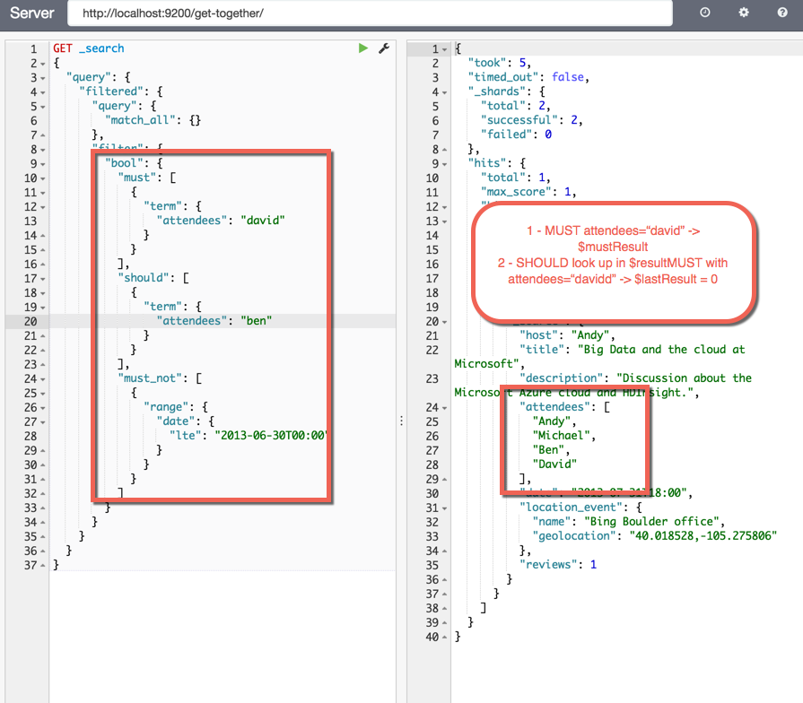
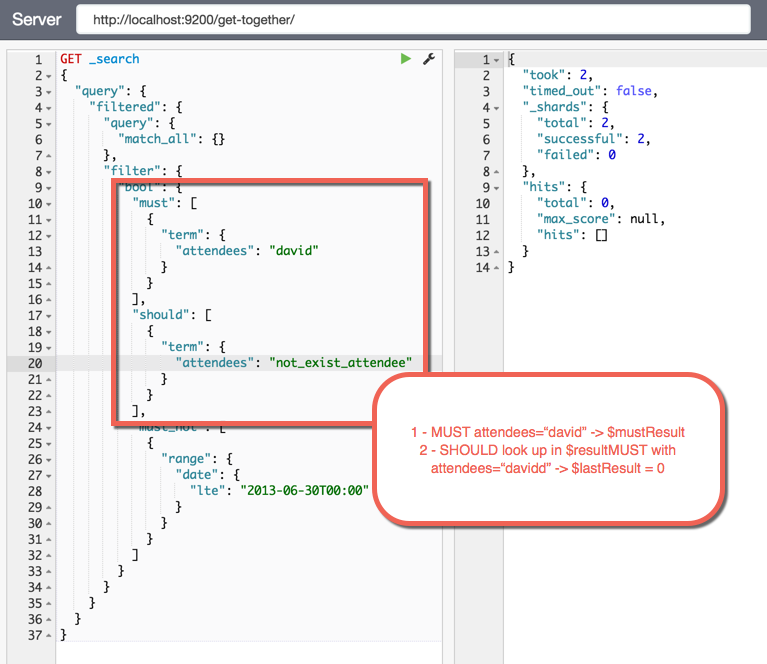

###Structure of search request



####Specifying a search scope



####Query for searchings



####Filter for searchings

- **_Filters can speed up queries by skipping the scoring calculations and by caching_**



```
- Search title=hadoop where host=andy
GET _search
{
  "query": {
    "filtered": {
      "query": {
        "match": {
          "title": "hadoop"
        }
      },
      "filter": {
        "term": {
          "host": "andy"
        }
      }
    }
  }
}
```

####Filter user _bitset_ to cache and limit the area




####Query String

```
References: www.lucenetutorial.com/lucene-query-syntax.html
{
  "query": {
    "query_string": {
      "query": "nosql OR tags:lucene AND -description:mongodb"
    }
  }
}
```

####Bool Query
- **must** && **mus_not**: _AND_ && _AND NOT_
- **should**: _OR_



####Cache
```json
// Assume the score of the query isn't important
'{
  “query”: {
    “filtered”: {
      "query": {
        "match_all": {}
      },
      "filter": {
        "fquery": {
          "query" : {
            "query_string" : {
              "query" : "name:\"denver clojure\""
            } 
          },
          "_cache": true
        }
      }
    }
  } 
}' 
```

###Use case

1) Searchbox: 
    - Use match/simple_query_string in specific fields
2) Search as phrase: 
    - Use match_phrase
3) Search in not_analyzed field:  
    - Use term query(not analyzed)
4) Combine many diff searches of types of search: 
    - Use **bool** query
5) Search words on many fields:
    - Use **multi_match**
6) Search documents that have no value for field:
    - Use **missing** filter
7) Autocomplete, match string: 
    - Use **prefix, wildcard** 


