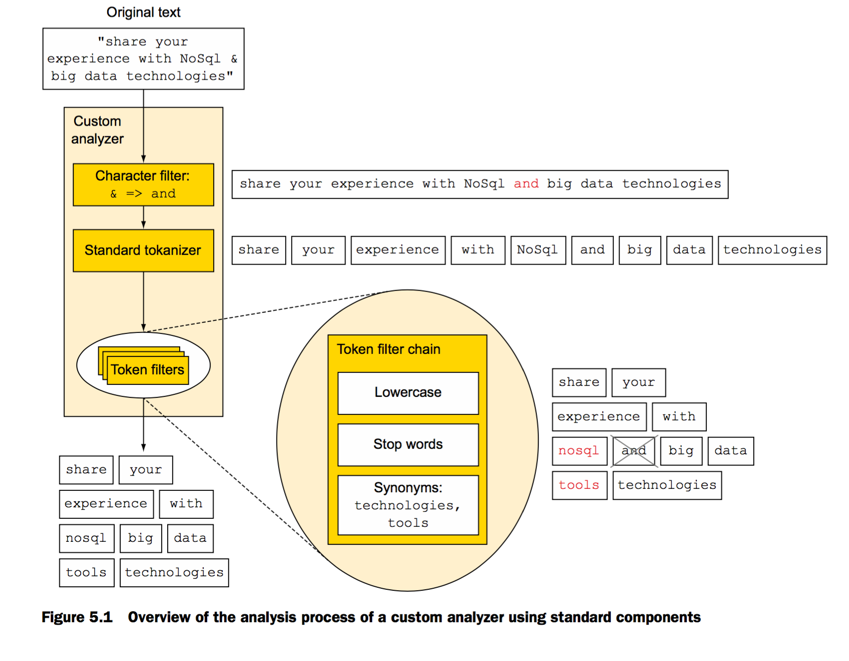
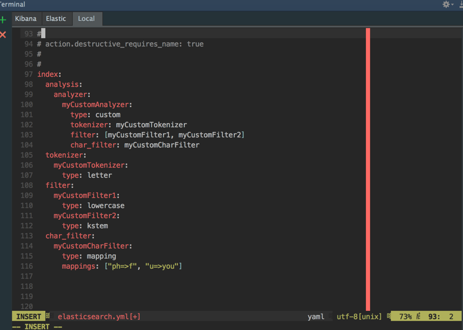
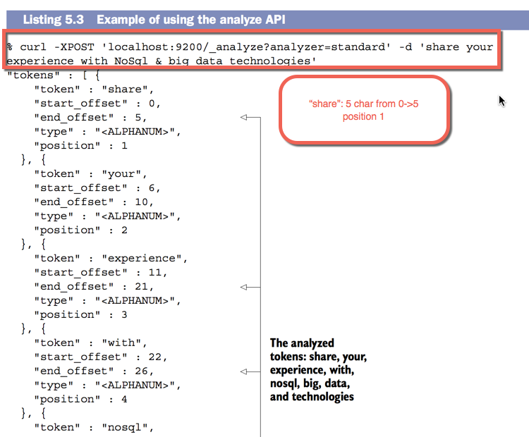
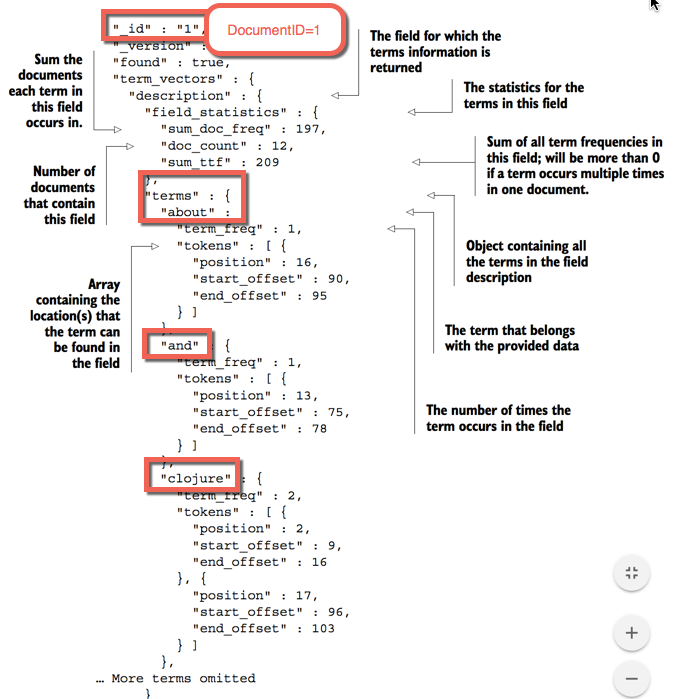
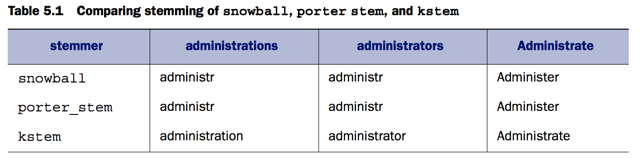

###Analyzing

- **It's important to keep this in mind that**:
1) Searching by _match && match phrase_ perform analysis before searching.
2) Searching by _term && terms_ DO NOT analysis.



####Using analysers for your documents

- Before unsing analysers. Elasticsearch needs to know how you want to analyzer.

1) Which fields need analyzer.
2) Which analyzer will be apllied.

####When you should specify analyzers

- Should specify analyzer When create an index
- If you often use the same set of analyzers through a lot of indices: put it into configuration file.

####Some practices



```html
1 - Analyzer when create an index

curl -XPOST  'localhost:9200/myindex' -d
'{
    "settings": {
        "number_of_shards": 2,
        "number_of_replicas": 1
    },
    "index":{
        "analysis": {
            "analyzer":{
                "myCustomAnalyzer":{
                    "type": "custom",
                    "tokenizer": "myCustomTokenizer"
                    "filter": ["myCustomFilter1", "myCustomFilter2"],
                    "char_filter": ["myCustomCharFilter"]
                }
            },
            "tokenizer":{
                "myCustomTokenizer" {
                    "type": "letter"
                }
            },
            
            "filter": {
                "myCustomFilter1": {
                    "type": "lowercase"
                },
                "myCustomFilter2": {
                    "type": "kstem"
                }
            },
            
            "char_filter": {
                "myCustomCharFilter": {
                    "type": "mapping",
                    "mappings": ["ph => f", "u => you"]
                }
            }
        }
    }
    "mappings": {
        "document": {
            "properties":{
                "description": {
                    "type": "string",
                    "analyzer": "myCustomAnalyzer"   
                },
                "name": {
                    "type": "string",
                    "index": "not_analyzed"
                }
            }
        }
    }
 }'

```

####Observe how Elasticsearch analysis through API



```html
- Selecting an analyzer

curl -XPOST 'localhost:9200/get-together/_analyze?analyzer=myCustomAnalyzer' –d 'share your experience with NoSql & big data technologies'

- Custom analyzer

curl -XPOST 'localhost:9200/_analyze?tokenizer=whitespace&filters=lowercase,reverse' -d 'share your experience with NoSql & big data technologies'

-> result: erahs, ruoy, ecneirepxe, htiw, lqson, &, gib, atad, seigolonhcet
```

####Learning more about terms through _termvector


- curl 'localhost:9200/get-together/group/1/_termvector?pretty=true'



 

###Tokenization

- Breaking a string to smaller chunks of 


####Standard Tokenizer

- Grammar-based, remove meaningless letters as ', .'

```html
curl -XPOST 'localhost:9200/_analyze?tokenizer=standard' -d 'I have, potatoes.'


```

####Pattern

- Setup **pattern1**
```html
 curl -XPOST 'localhost:9200/pattern' -d '{
    "settings": {
        "index": {
            "analysis": {
                "tokenizer": {
                    "pattern1": {
                        "type": "pattern",
                        "pattern": "\\.-\\."
    }}}}}}'
    
curl -XPOST 'localhost:9200/pattern&pretty' -d '{
 "settings": {
     "index": {
         "analysis": {
             "tokenizer": {
                 "pattern3": {
                     "type": "pattern",
                     "pattern": "\\.-\\."
 }}}}}}'   
```

- Analyze as **pattern1**
```html
 curl -XPOST 'localhost:9200/pattern/_analyze?tokenizer=pattern1&pretty' \
-d 'breaking.-.some.-.text'

=> Result

{
  "tokens" : [ {
    "token" : "breaking",
    "start_offset" : 0,
    "end_offset" : 8,
    "type" : "word",
    "position" : 0
  }, {
    "token" : "some",
    "start_offset" : 11,
    "end_offset" : 15,
    "type" : "word",
    "position" : 1
  }, {
    "token" : "text",
    "start_offset" : 18,
    "end_offset" : 22,
    "type" : "word",
    "position" : 2
  } ]
}

```

####UAX URL Email

1) Bad practice
- curl -XPOST 'localhost:9200/_analyze?tokenizer=standard' -d 'john.smith@example.com'
- The tokens are **john.smith** and **example.com** .

2) Look better with **uax_url_email**
-  curl -XPOST 'localhost:9200/_analyze?tokenizer=uax_url_email' -d 'john.smith@example.com http://example.com?q=bar'
- The tokens are **john.smith@example.com** and **http://example.com?q=bar** .

####Path Hierarchy

```html
curl 'localhost:9200/_analyze?tokenizer=path_hierarchy' \
-d '/usr/local/var/log/elasticsearch.log'

The tokens are /usr, /usr/local, /usr/local/var, /usr/local/var/log, and /usr/
local/var/log/elasticsearch.log.
```

###Token filters

- Set of filters apply on each tokens.

####Length filter

```html
curl -XPUT 'localhost:9200/length' -d '{ 
    "settings": {
        "index": {
            "analysis": {
                "filter": {
                    "my-length-filter": {
                        "type": "length",
                        "max": 8,
                        "min", 2
                    }}}}}}'

curl 'localhost:9200/length/_analyze?tokenizer=standard&filters=my-lengthfilter&pretty=true' -d 'a small word and a longerword'

=> small, word, and and
```

####Stop

Remove terms as default list: a, an, and, are, as, at, be, but, by, for, if, in, into, is, it, no, not, of, on, or, such, that, the, their, then, there, these, they, this, to, was, will, with

```html
curl -XPOST 'localhost:9200/stopwords' -d'{
 "settings": {
    "index": {
        "analysis": {
            "analyzer": {
                "stop1": {
                    "type": "custom",
                    "tokenizer": "standard",
                    "filter": ["my-stop-filter"]
                }
            },
             "filter": {
                "my-stop-filter": {
                    "type": "stop",
                    "stopwords": ["the", "a", "an"]
             }}}}}}'
 
 OR from file
 
 "filter": {
    "my-stop-filter": {
        "type": "stop",
        "stopwords_path": "config/stopwords.txt"
  }}
```

###Ngrams

- Can be useful for searching with prefix as **sp, spa, spag, spagh, spaghe** 

```html
curl -XPOST 'localhost:9200/ng' -d'{
    "settings": {
        "number_of_shards": 1,
        "number_of_replicas": 0,
        "index":{
            "analysis": {
                "analyzer": {
                    "ng1": {
                        "type": "custom",
                        "tokenizer": "standard",
                        "filter": ["reverse", "ngf1", "reverse"]
                    }
                },
                "filter": {
                    "ngf1": {
                        "type": "edgeNGram",
                        "min_gram": 2,
                        "max_gram": 6
                    }
                }
            }
        }
    }
}'

curl -XPOST 'localhost:9200/ng/_analyze?analyzer=ng1' -d 'spaghetti'
tokens: ti, tti, etti, hetti, ghetti (reverse and limit letters)
```

###Stemming

- Stemming is the act of reducing a word based on root word.



```html
curl -XPOST 'localhost:9200/_analyze?tokenizer=standard&filters=kstem&pretty' -d 'administrators'

{
  "tokens" : [ {
    "token" : "administrator",
    "start_offset" : 0,
    "end_offset" : 14,
    "type" : "<ALPHANUM>",
    "position" : 0
  } ]
}
```


