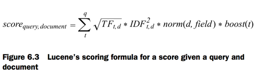
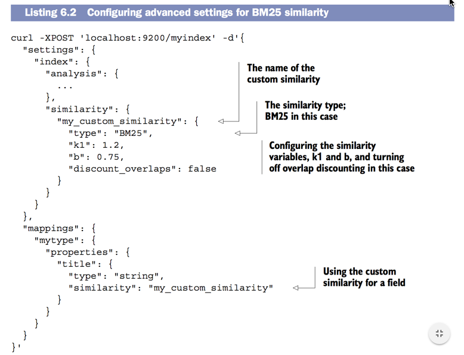
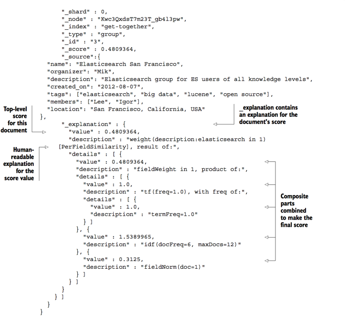
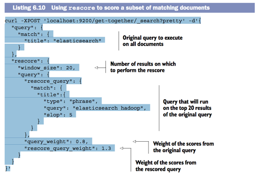
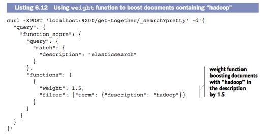
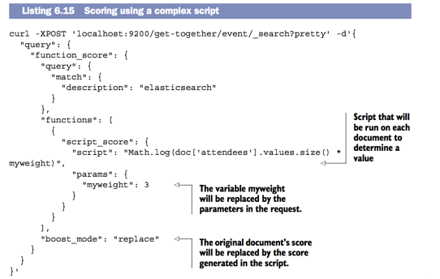

##Searching with relevancy

###How scoring works in Elasticsearch

- How many times a term occurs in document(TF-IDF)

- IDF ignore common term as in, the, a, an...
- TF count how frequency the term occurs

####TF Term frequency (Default)

- Term frequency is how many times a term appears in a document

- Score = 1 : “We will discuss **Elasticsearch** at the next Big Data group.”

- Score = 2 : “Tuesday the **Elasticsearch** team will gather to answer questions about **Elasticsearch**.”

####IDF inverse document frequency (Default)

- Check to see if a term occurs or not. DO NOT care a bout how often it occurs.
- It's useful when the user search "A door, The door" and term "A" && "The" will be ignored.  



###1 - Okapi BM25 - Other scoring methods 

- **BM25** known as probabilistic scoring framework
- **similarity** is a parameter to change other scoring framework 

1) Change similarity in mappings
```
"mappings": {
    "get-together": {
        "properties": {
            "title": {
                "type": "string",
                "similarity": "BM25"
            }
        }
    }
}
```

2) Configure Elasticsearch to use alternate scoring method



3) Configre in global (index.similarity.default.type: BM25 inelasticsearch.yml)


####Okapi BM25 - Testing your scoring

- BM25 has three main settings--k1,b, and discount_overlaps:

- k1 control how important TF(term frequency)
- b between 0 and 1 that controls what the length of the document has on the score.
- k1 is set to 1.2 and b is set to 0.75 by default.


####Okapi BM25 - Should not be changed default settings

- Keep in mind that if you do tweak these settings, you need to be sure to have a good testing infrastructure.
- It makes no sense at all to change relevancy algorithm settings

###Boosting

- **title** important more than **description** and to accomplish this we use "boosting".

- Boosting is the process by which you can modify the relevance of a document.


1) Boosting while indexing (do not recommend cause it will re-index the document)
2) Boosting when query (Strongly recommend)


####Go boost

- default **10** for every single field

```
curl -XPOST 'localhost:9200/get-together/_search?pretty' -d'{
"query": {
"bool": {
    "should": [
    {
        "match": {
            "description": {
                "query": "elasticsearch big data",
                "boost": 2.5
            }
        }
    },
    {
        "match": {
            "name": {
                "query": "elasticsearch big data"
        }
    }
}]
}}}}'

 
Before:
"_score" : 0.006054071,

After: 
"_score" : 0.008159049,
"_source" : {
"title" : "Logging and Elasticsearch",
"description" : "Get a deep dive for what Elasticsearch is and how it can be used for logging with Logstash as well as Kibana!",
         

curl -XPOST 'localhost:9200/get-together/_search?pretty' -d'{
 "query": {
    "multi_match": {
        "query": "elasticsearch big data",
            "fields": ["name^3", "description"]
         }
    }
}'
```

###II - Understanding how a document was scored with explain

- turn on flag "explain": true

```
curl -XPOST 'localhost:9200/get-together/_search?pretty' -d'
{
 "query": {
    "match": {
        "description": "elasticsearch"
    }
 },
 "explain": true
}'

```



- value "1.0"(TF): "elasticsearch" occurs once in this document
- value "1.5389965"(IDF): "elasticsearch" in 6 out of the 12 documents in this index
- value "0.3125"(Normalization): 
- 1.0 x 1.5389965 x 0.3125 = 0.4809364.

####Why a document did not match

- Actually "elasticsearch" does not exist in "Failure to meet condition(s) of required/prohibited clause(s)" so it does not match.

```
curl -XPOST 'localhost:9200/get-together/group/4/_explain?pretty' -d'{
"query": {
    "match": {
        "description": "elasticsearch"
    }}}'

"_id" : "4",
"matched" : false,
"explanation" : {
"value" : 0.0,
"description" : "Failure to meet condition(s) of required/prohibited clause(s)",
"details" : [ {
  "value" : 0.0,
  "description" : "no match on required clause (description:elasticsearch)",
  "details" : [ {
    "value" : 0.0,
    "description" : "no matching term",
    "details" : [ ]
  } ]
}, { ...

```

####Rescore a subset of matching documents

- Because TF-IDF was optimized and index so **rescore** after match sound good.

```html
curl -XPOST 'localhost:9200/get-together/_search?pretty' -d '{
"query": {
  "match": {
    "title": "elasticsearch"
  }
},
"rescore": {
  "window_size": 20,
  "query": {
    "rescore_query": {
      "match": {
        "title":{
        "type": "phrase",
        "query": "elasticsearch hadoop",
        "slop": 5
  }}},
  "query_weight": 0.8,
  "rescore_query_weight": 1.3
}}}'
```



- Briefly: match 20 results, rescore with "match_pharse" query (assume "elasticsearch hadoop" is a term) on 20 results was matched.


####Weight and Math

1) Weight: Term "hadoop" in "description" will have their score multiplied by 1.5



2) Math: Extremely powerful because you can do anything you'd like inside it




