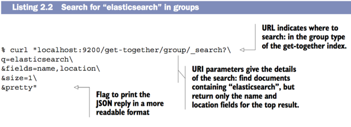
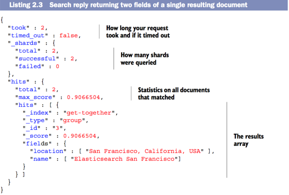

###I - Elasticsearch CRUD

####1 - PUT a row (indexed document)
```
curl -XPUT 'localhost:9200/get-together/group/1?pretty' -d '{
          "name": "Elasticsearch Denver",
          "organizer": "Lee"
}'

response index(DB), type(table), ID of the indexed document
{
  "_index" : "get-together",
  "_type" : "group",
  "_id" : "1",
  "_version" : 1,
  "created" : true
}

```

####CREATE a database(index) 
```

curl -XPUT 'localhost:9200/new-index

response: 
{"acknowledged":true}
```

####Get all mappings within database

```
curl 'localhost:9200/get-together/_mapping/group?pretty'
{
  "get-together" : {
    "mappings" : {
      "group" : {
        "properties" : {
          "name" : {
            "type" : "string"
          },
          "organizer" : {
            "type" : "string"
          }
    }}}}}
```

```
1 - git clone https://github.com/dakrone/elasticsearch-in-action.git

2 - run "populate.sh" file to recreate database get-together:

./populate.sh
```

###II - Searching for an retrieving data



####1 - Where to search

```
1 - Search in myltiple databases (indices)
curl "localhost:9200/get-together,other-index/_search...
curl "localhost:9200/_all/_search/...
curl "localhost:9200/_search/...

2 - Search in multiple tables (Types)
curl "localhost:9200/get-together/group,event/_search?q=elasticsearch&pretty
curl "localhost:9200/get-together/_all/_search... (all)
curl "localhost:9200/get-together/_search... (all)

```

####2 - Content Reply


- The **_score** is the measure of how relevant.
    Is caculated with **TF-IDF**
    
####3 - How to search

```
curl 'localhost:9200/get-together/group/_search?pretty' -d '{"query": {
    "term": {
        "name": "elasticsearch"
   }}}'

```

- **filtered query**: Do not care about _score (Are not sorted by score).
```
curl 'localhost:9200/get-together/group/_search?pretty' -d '{
  "query": {
    "filtered": {
      "filter": {
        "term": {
          "name": "elasticsearch"
        }}}}}'
```
- **aggregations** kind of **group** and **count** in SQL 

```
curl localhost:9200/get-together/group/_search?pretty -d '{
  "aggregations" : {
    "organizers" : {
      "terms" : { "field" : "organizer" }
}}}'
```

### III - Configuring Elasticsearch

#### 1 - Sepcifying a cluster name in elasticsearch.yml

- Mean that you create new folder, new database -> no more data in new database
```
brew info elasticsearch #All paths in Elasticsearch

nvim /usr/local/etc/elasticsearch/elasticsearch.yml

```

#### Specifying verbose logging via logging.yml

- When something goes wrong

```
/usr/local/var/log/elasticsearch/elastcsearch_luc.log
```

export ES_HEAP_SIZE=500m; bin/elasticsearch

#### Adding nodes to the cluster

- Open new tab and **elasticsearch**

- 4 shards just only distributed maximum by 4 nodes

- **Increase the number of shards just only increase the number of concurrent searches** your cluster can server 

- **round-robin** aggregates results from set of shards and response once.


