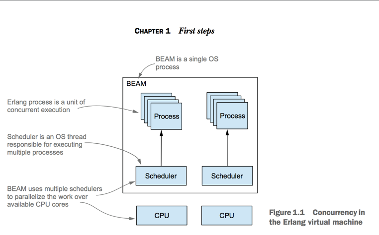
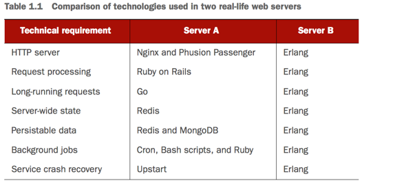
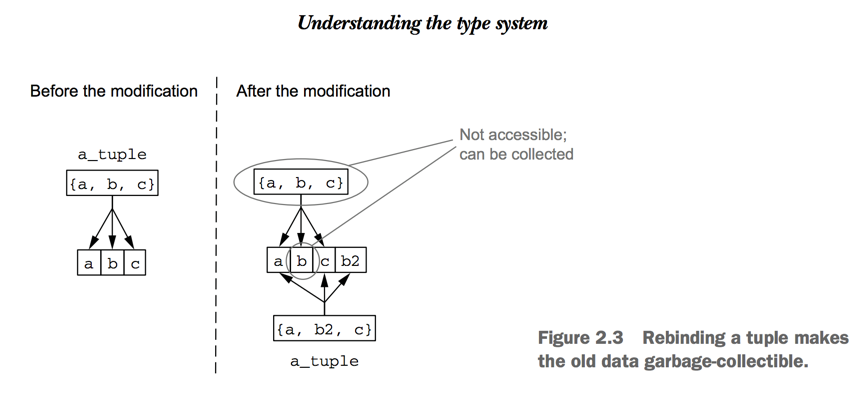

###I - About Erlang

- Erlang is more than a programming language. It's a development platform consisting of four distinct parts: the language, the virtual machine, the framework and the tools.

- Erlang code is compiled into byte code then  executed in the BEAM. 

- Instead of relying on heavyweight threads and OS processes, Erlang takes concurrency into its own hands.

- The standard part of the release is a framework called **Open Telecom Platform(OTP)**:
    1) Concurrency and distribution patterns
    2) Error detection and recovery in concurrent systems
    3) Packaging code into libraries.
    4) System development
    5) Live code updates

####Server-side systems

- The term server-side systems indicates that request handling, run various background jobs and manage some kind of server-wide in-memory state.

- A server-side system is often distributed on multiple machines.

####Comparison of technologies used in two real-life web servers

- ServerA: It's not contained in a single project, the components are deployed separately.
- ServerB: The entire server is a **single project** that runs inside a **single BEAM OS**. **Concurrency** is handled completely by the **Erlang scheduler**.

###II - About Elixir

- Elixir is an alternative language for the Erlang virtual machine that allows you to write cleaner code. you write programs in Elixir and run them normally in BEAM.

- Elixir targets the Erlang runtime, compile to bye-code be able run in a BEAM OS and **can normally cooperate with pure Erlang code**.

- So you can use Erlang libraries from Elixir and vice versa

- In author experiences: The Elixir solution is usually easier to develop and maintain.
 
 
####Summary

- Elixir code is devided into modules and functions.
- Elixir type depend on the value it holds.
- Data is immutable. The modified version shares as much memory as posible with the original data.

- The most important primitive data types are **numbers, atoms, binaries**.

- The only complex types are tuples, lists, and maps. Tuples are used to group a small, **fixed-size** number of fields. Lists are used to manage variable-size collections. A map is a key-value pair data structure.

- Functions are first-class citizens.
- Module names are atoms that correspond to **beam** files on the disk. 

