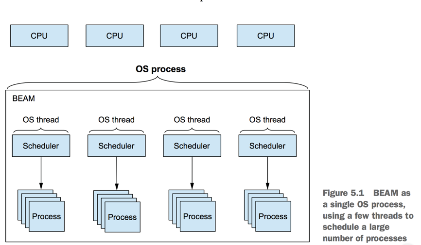

##Part II - Concurrency Primitives

###1) BEAM Priciples

- Minimize, isolate and recover from the effects of runtime errors(fault tolerance).

- Handle a load increase by adding more hardware resources without changing or redeploying code (scalability).

- Run your system on multiple machines so that others can control if one machine crashes(distribution).

- In BEAM, a unit of concurrency is a **process** that building block. So it possiple to scalable, fault-tolerant, distributed systems.



###2) Working with processes

- In the BEAM world, to run something concurrently, you have to crete a separate process.

####Create a process

```elixir
run_query = fn(query_def) ->
 :timer.sleep(2000)
 "#{query_def} result"
end

#spawn create a PID #PID<0.96.0>
spawn(fn -> IO.puts(run_query.("query 1")) end)

# Pass data to the created process
async_query = fn(query_def) ->
    spawn(fn -> IO.puts(run_query.(query_def)) end)
end

# After 2 seconds, print 5 queries in the same time (Not 10 seconds)
Enum.each(1..5, &async_query.("query#{&1}"))
```

- 5 queries was printed in the same time because each computation is a separate process in separate thread..

####In complex systems

- Being completely isolated, process can't use shared data structures to exchange knowledge. Instead, processes comunicate via messages. A message is deep-copied when it's being send.

```elixir
send(self, {:message, 1})

receive do
  {:message, id} ->
    IO.puts "received message has an ID: #{id}"
end

```


####How 'receive' works

1) Take the first message from the mailbox.
2) Try to match any patterns, go from top to bottom.
3) If match run corresponding code
4) If not match, waiting... until blocks 


###3) Working with stateful server processes

###4) Runtime considerations