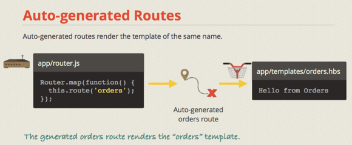

####Ember-cli

1. npm install -g ember-cli
2. ember new <app-name>
3. ember serve
- ember version
- ember help


var Notes = Ember.Application.create({});

Notes is `application` contain `route, controller, view, template`.

####Routes

```
Link Template
{{#link-to "orders" tagName="div" class="orders-link"}} Orders {{/link-to}}
```
| MySQL           | Elasticsearch     |
| ---             | ---               |
| debugger        | Stop processing to enter the debuger           |
| log             | console.log             |
| link-to         | Create link-to             |
| unless/if/each  | Types             |
| input/textarea  | Documents with Fields|

####Single page application why update URL

1) Ember uses the URL to keep track of where the user is in.

2) **The site links are shareable** && **back button**


```
app/routes/orders.js
ember g route orders
```


####Route detail an order

```
ember g route order

- app/routes/order.js
export default Ember.Route.extend({
  model(params){
    return [
      {id: 1, name: "Nate"},
      {id: 2, name: "Gregg"},
    ].findBy('id', parseInt(params.order_id));
  }
});

- app/templates/orders.hbs
{{ #each model as |order| }}
  {{ #link-to ??? }}
    Order {{order.id}} for {{order.name}}<br>
  {{/link-to}}
{{/each}}
```

###Service 

```
ember generate server store

- app/services/store.js
export default Ember.Service.extend({
  getOrderById(id){
    const orders = this.getOrders();
    return orders.findByIds('id', id);
  },

  getOrders(){
    return [
      {id: '1', name: 'Nate'},
      {id: '2', name: 'Gregg'}
    ];
  }
});

- better app/routes/order.js
model(params){
    const id = params.order_id;
    const store = this.get('store');
    return store.getOrderById(id);
  },
  store: Ember.inject.service()
}
```


###Model - Ember.Object

1) **Ember.Object** support for creating and destroying records

2) Object lifecycle envets and hooks

3) Properties and property **observation** functionality (This is how templates are updated when properties change)

```
export default Ember.Object.extend({});
```

- **Route Object**: request the Model from Rails server(or work with other APIs)

- Or can say that **Route Object** communicate with Models.

- **Fat Controllers**: In Ember `logic put inside controller` instead Model as Rails
```
-EmberController
App.UserController = Ember.ObjectController.extend({
  fullName: function(){
    return this.get("first_name") + " " + this.get("last_name");
  }
})

-As Rails Model
def fullname
  first_name + last_name
end
```

### Ember Views


