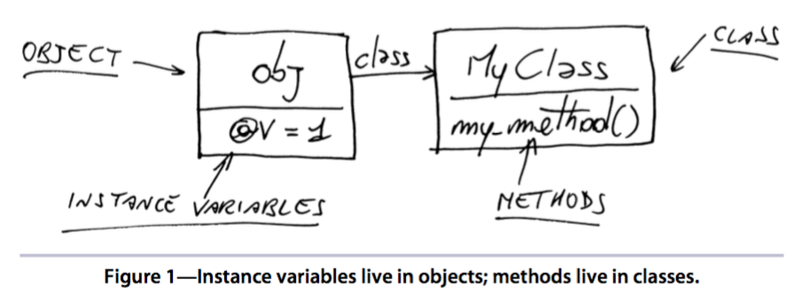
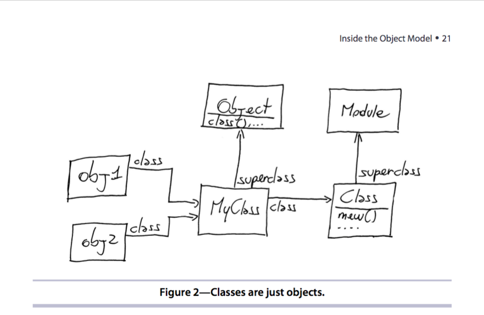

#Chapter 2
##Monday: The Object Model

- Metaprograming manipulates these language construct
- **Object Model**: all the constructs live together in a system called object model

###I - Open Class

- Where you refactor some legacy code and learn a trick or two along the way.
 
```ruby
def to_alphanumeric(s)
  s.gsub(/[^\w\s]/, '') #remove weird characters
end
to_alphanumeric("asd zxc 123 !@# $#")
```
 
- Yah, It's not OOP, it's just a function make sense for all **String** right?
- How about if we could ask a **String** to convert itself??? looks better, more OOP, turn a useful method into right place??

```ruby
# Reopen class String
class String
  def to_alphanumeric
    s.gsub(/[^\w\s]/, '') #remove weird characters
  end
end

"asdzxc 123 !@#$ %#@".to_alphanumeric
```

- This makes sense for all strings. It'd be better if could ask a String to convert itself, rather than pass it through an external method.

###II - The Problem with Open Classes

```ruby
class Array
  def replace(original, replacement)
    puts "I've replaced #{original} with #{replacement}"
  end
end
```

- So so so, What's heppen, Why a lot of tests go fail???
- Class **Array** already has a method named replace. When you defined your own **place** method. You overwrote the **original replace**.

- Some trick as modify existing method is called **Monkeypatch**
- Also, be aware some changes are risker than others. So **adding a new method is usually safer than modifying an existing one**.

###III - Inside the Object Model

- Where you learn surprising facts about objects, classes and constants.
    1. Instance Variables (@var)
    2. Methods

####1 - Instance Variables (@var)

- List of an object's instance variables by calling **Object#instance_variables**

```ruby
class MyClass
  def my_method
    @v = 1
  end
end

obj = MyClass.new
obj.instance_variables #[]
obj.my_method
obj.instance_variables #[:@v]
```

- Unlike in Java or other static languages, in Ruby there is no connection between object's class and its instance variables.
- So if you hadn't called obj.my_method, then obj would have no instance variable at all.

####2 - Methods

- List of an object's methods by calling **Object#methods**

- **An object contains its instance variables and a reference to a class**.
- Objects that share the same class also share the same methods, **so the methods must be stored in the class, not the object.**


###IV - The Truth About Classes

- Classes themselves are nothing but objects.
- Because a class is an object, everything that applies to objects also applies to classes.

```ruby
"hello".class             # => String
String.class              # => Class : looks weird
String.superclass         # => Object
Object.superclass         # => BasicObject
BasicObject.superclass    # => nil  : BasicObject is the root of the Ruby class hierarchy
```

###V - Modules

- Take a deep breath and check out the superclass of the **Class**

```ruby
Class.superclass # => Module 
```

- A class is a module with three additional instance methods **(new, allocate, and superclass)** that allow you to create objects or arrange classes into hierarchies.

- You pick a module when you mean it to be included somewhere.
- You pick a class when you mean it to be instantiated of inherited.



###VI - Constants

- Constant: Any reference that begins with an **uppercase letter, including the name of classes and modules, is a constant.

- **If you can change the value of a constant, how is a constant different from a variable? The one important difference has to do with their scope.**

```ruby
module M
  class C
    X = 'Inner constant'
  end
  X = 'Outer constant'
end

M::C::X # 'Inner constant'
M::X    # 'Outer constant'
```

- All the constants in a program are arranged in a tree similar to a file system. Where modules(or classes) are directories and regular constants are files.


