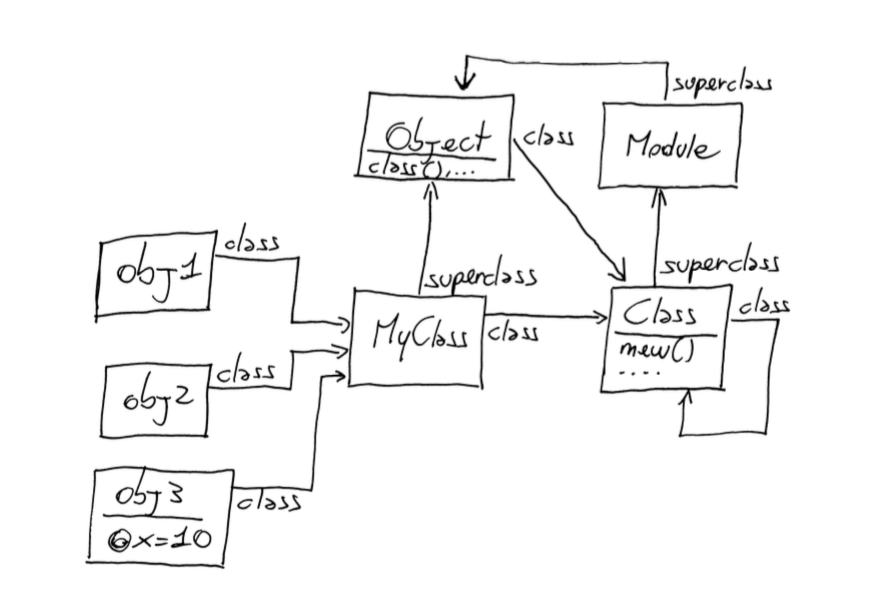

#...Chapter2

###I - What Happens When You Look Up A Method



- When you call a method. Ruby does two things.
    1. It finds the method. This is a process called method looking.
    2. It executes the method. To do that, Ruby needs something called **self**
    
    
    
####1 - Method Lookup
    
- You need to know about two new concepts: 
    1. **the receiver**: is the object that you use to call a method (my_string.reservse() than my_string is the receiver)
    2. **the ancestors** go one step to the right into receiver's class, and then go up the ancestors chain until you find the method.

```ruby
MyClass.ancestors # => [MyClass, Object, Kernel, BasicObject] : Kernel is a module, not a class
```

#####1.1 - Modules and Lookup

- Ruby inserts the module in the ancestors chain
- Starting from Ruby 2.0, you also have a second way to insert a module in a class's chain of ancestors (**prepend && include**)

####2 - Method Excecution

- When you call a method, It needs to tuck away a **reference to the receiver**.
- It can remember who the receiver is as it executes the method

#####2.2 The self Keyword

- **self**: implicitly receiver
- **obj**: explicitly receiver

- Every line of Ruby code is executed inside an object-the so-called **current object**. 
- The current object is also known as **self**
- 
```ruby
class MyClass
  def testing_self
    @var = 10
    my_method()
    self
  end
  
  def my_method
    @var = @var + 1
  end
end

self                #main : The top level
self.class          #Object < BasicObject, so every line of code are wrapped in Object class
obj = MyClass.new   #<MyClass:0x007f8b3bf04b78>
obj.testing_self    #<MyClass:0x007f8b3bf04b78 @var=11> 
```

####2.3 - What private Really Means

- **By a single simple rule: you can not call a private method with an explicit receiver.**

```ruby
class C
  def public_method
    self.private_mathod
  end
  
  private
  
  def secret
    puts "This is an secret"
  end
end

obj = C.new
obj.public_method   # "This is an secret"
obj.secret  # NoMethodError: private method 'secret' called for #<C:0x007f8b3f52da88>

```

- Can you call a private method that you inherited from a superclass?? 
    1. The answer is YES, because you don't need an explicit receiver to call inherited methods on yourself.
   
    
####3 - Refinements
    
- Open Classes: The change are global
- To active the changes, you have to do so **explicitly with the using method**

```ruby
module StringExtension
  refine String do
    def to_alphanumeric
      puts "To alphanumeric"
    end
  end
end

"my !@#$ String".to_alphanumeric # NoMethodError

using StringExtension
"my !@#$ String".to_alphanumeric # "To alphanumeric"

```

##Wrap-Up

- **An object** is composed of a bunch of **instance variables** and **a link to a class**.

- **The methods** of an object live in the object's class, also known as **instance methods**

- **The class** itself is just an object of class **Class**. The nam of the class is just a constant.

- **Class** is a subclass of Module. **A module is basically a package of methods**. In addition to that, a class can also be instantiated(with new) or arranged in a hierarchy(through its superclass)
 
- **Constants** are arranged in a tree similar to a file system, where the names of modules and classes play the part of directories and regular constants play the part of files.
  
- **Ancestors chain**: Each class has an ancestors chain, beginning with the class itself and going up to BasicObject

- **Method Lookup**: When you call a method, Ruby goes tight into the class of the receiver and then up the ancestors chain, until it either finds the method reaches the end of the chain

- **When you include a module** in a class, the module is inserted in the ancestors chain right **above** the class itself.
- **When you prepend a module** it  is inserted in the ancestors chain right **below** the class

- When you call a method, the receiver takes the rol of self

- When you're defining a module (or a class), the module takes the role of self.

- Instance variables are always assumed to be instance variables of self.

- Any method called without an explicit receiver is assumed to be a method of self


    