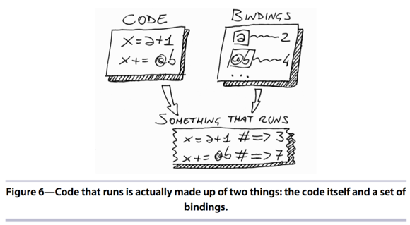

#Chapter 4: Blocks

- You're probably already familiar with blocks-you can't write much Ruby code without them. But what you might not know is that blocks are a powerful tool for controlling scope.

- Blocks are just a **callable objects** such as prods, lambdas.

- Blocks have a different that can be **back to functional programing** such as LISP

##I - The Basics of Blocks

- Roadmap:
    1. A review of the basics of blocks
    2. An overview of scopes and how you can carry variables through scopes by using blocks **as closures**.
    3. How you can further manipulate scopes by passing a block to instance_eval
    4. How you can convert blocks into callable object that you can set aside and call later such as Procs and lambdas.

```ruby
def a_method(a,b)
  a + yield(a, b)
end

a_method(1, 2){|x, y| (x+y) * 3}  # => 10
a_method(1, 2)                    #LocalJumpError: no block given (yield)

def a_method(a, b)
  a + yield(a, b) if block_given? #To avoid Block
end
```

- Within a method, you can ask Ruby whether the current call includes a block Kernel#block_given? method.


##II - Blocks Are Closures

- How you can carry variables through scopes by using blocks **as closures**



- The blocks contain both code and a set of bindings at the moment

```ruby
def my_method
  x = "x is a local variable of a method, right?"
  yield
end

x = "bring me in to my_method"
my_method{ x } # "bring me in to my_method"
```

- When you create the block, you capture the local bindings such as x

###1 - Scopes

- In debugger environment, until you finally hit a breakpoint. Now catch your breath and look around.
    1. See the scenery around you? That's your scope.
    
- Java and C# allow **"inner scope"** to see variables from **"outer scope"**
- Ruby: it does not happen cause it's scope are separate completely. 
    1. When you change a scope, it will replace previous scope by a new set of bindings
    
###2 - Global Variables($var) 
    
- Global variables can be accessed by any scope
    
```ruby
def a_scope
  $var = "Global value" 
end

$var # => "Global value"
```    

- The problem with global variables is that every part of the system can change them, so in no time you'll find it difficult to track who is changing what.

###3 - Top-Level Instance Variables(self of main, yup)

- You can access a top-level instance variable whenever main takes the role of self

- Using Instance variables safer than global variables.

###3 - Scope Gates

- There are exactly three places where a program leaves the previous scope behind and opens a new one
    1. Class def
    2. Module def
    3. Methods def
    
- Scope change whenever the program enters(or exits) a class or module or method.
    
```ruby
v1 = 1
class MyClass                     #START SCOPE GATE of Class
  v2 = 2
  local_variables                 # => [v2]
  
  def my_method                   #START SCOPE GATE of method
    v3 = 3
    local_variables               # => [v3]
  end                             #END SCOPE GATE of method
  
  local_variables                 # => [v2]
end                               #END SCOPE GATE of Class

obj = MyClass.new
obj.my_method       # => [:v3]
local_variables     # => [:v1, :obj]
```    

###4 - Flattening the Scope(Giảm scope)

- The more you become proficient in Ruby where you want to pass bindings through a Scope Gate.
    1. Class.new do ... end (closures for Class)
    2. define_method :method_name do ... end (closures of Method)
    
###5 - Sharing the Scope

```ruby
def my_method_is_sharing_box
  shared  = 0
  
  Kernel.send :define_method, :get_shared do
    shared 
  end
  
  Kernel.send :define_method, :count do
    shared += 1
  end
end

my_method_is_sharing_box
get_shared #0
count      #1 
get_shared #1

```

- No other method can see shared because it's protected by Scope Gate. This smart way to control the sharing of vartiables is called **Shared Scopes**

##Closures Wrap-Up

- Each Ruby scope contains a bunch of bindings, and the scopes are separated by Scope Gates: class, module, method

- If you want to bring a set of binding through a Scope Gate, you can use closures

- **Flat Scope**: You can replace class with Class.new, module with Module.new, method with define_method

- **Shared Scope**: should share variables in a Scope Gate


    
    
    
    
    